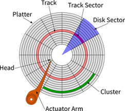

1. Quando o botão power do computador é pressionado, a BIOS inicia o processo de diagnósticos POST (Power-On-Self-Tests) que começar procurando por dispositivos bootáveis
2. Quando a BIOS encontra um dispositivo bootável, reconhecendo o mesmo pelo número mágico - Os bytes 510 e 511, que tem os valores 0x55 e 0xAA respectivamente - Ela carrega na memória a partir de 0x7C00 e usa os próximos 512 bytes. Todos os bytes, exceto os 2 últimos podem ter código executável. Para boot em hd, é necessário um MBR no deslocamento 0x01bd. Seguido pelas tabelas das 4 partições primárias com 16 bytes por entrada (0x01be - 0x01fd) e a assinatura de bytes (0x01fe - 0x01ff)
O MBR tem 512 bytes e é dividido em 3 partes
- 0x00000 - 0x1BD (446) - Código executável, incluindo o bootloader
- 0x1BD - 0x1FD (64) - Tabela de partições (4 entradas de 16 bytes para as 4 partições primárias)
- 0x1FD - 0x1FF (2 bytes) - assinatura mágica, 0x55AA
3. Quando a bios carrega o MBR/booatloader ela guarda o número do drive de boot no registrador DL (Parte baixa de DX)
- 0x00 -> Floppy
- 0x80 -> HDD 1
- 0x81 -> HDD 2
4. O boot sempre acontece em real mode (16 bits), e ativar e testar o protected mode é necessário para inicializar o restante do hardware 

5. Finalmente, o bootloader carrega o kernel e passa o controle para ele, essa parte permite o uso de linguagens de nível mais alto (Como C)

# Como

Para carregar o sistema devemos pensar em 
 - em qual Hd rodar, procurando partições ativas ou apresentando ao usuário a opção de escolher entre vários SO
 
 ## Regras:
 - O mbr precisa de exatamente 512 bytes
 - A BIOS procura o MBR nos discos nos cylinder 0, Head 0 e Sector 0

 - A BIOS precisa entender o Código 

